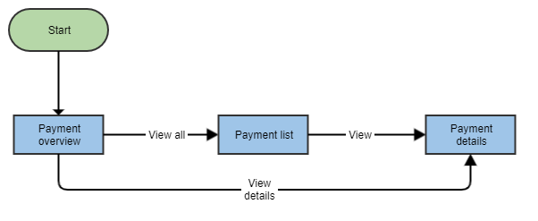

# User journey and exercise steps

## User journey

> As a retail banking user, I want to list and check the payments from my bank account. 

The application will consist of three different views:
* an overview of the last “Recently executed payments” and the “Upcoming payments”
* a list of all the existing payments with search functionality
* the detailed view of a single payment 

Technically, this translates into these Banklets:
* Dashboard - contains 2 instances of the "Dashboard Payment List".
* Payments - contains "Payment Overviews" Banklet.
* Payment Detail - contains "Payment Detail" Banklet.

The following diagram illustrates the navigation flow across the three views:

### Landing page

The landing page that the user will see upon starting the application includes the navigation menu and the payment list dashboards.

The navigation menu will show two links:

* a "Dashboard" link that brings the user to the two instances of "Dashboard Payment List"
* a "Payments" link that goes directly to the list of payments

### Payment overview

In payment overview, the user will see two tables: “Recently executed payments” and “Upcoming payments”.

In each one of those tables, the user will have two options:

* clicking on a table entry will navigate to "Payment details" view
* clicking on the "View all" link will navigate to the "Payment list" view

### Payment list

Payment list allows the user to view and filter the entire list of payments as well as export a PDF with the selected list.

Each list entry has a context menu that allows the user to navigate to the respective payment details view.

### Payment details

This page shows the details of a selected payment.

## Steps

This folder groups the different workshop steps. Each one of them represent incremental changes to the previous one.

* [Step 1. Project setup](./step1.md)
* [Step 2. Integrate a Banklet](./step2.md)
* [Step 3. Navigation between Banklets](./step3.md)
* [Step 4. Configuration of Banklets](./step4.md)
* [Step 5. Internationalization (i18n)](./step5.md)
* [Step 6. Modify theme](./step6.md)
