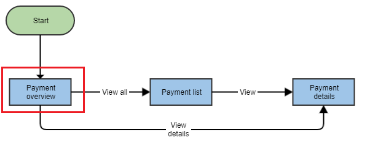

# 2. Integrate a Banklet	

## Goal 
 
* Understand Banklet modules as dependencies
* Learn how to add a Banklet to a base application
* Learn how to pass run time parameters to Banklets

## Tasks

In this step we will build the payment overview dashboard, which is the page users will land on:




### 2.1 Create dashboard component 

Generate a new empty component via the Angular CLI. In the third command line we opened in the previous step, copy and paste the following line:

```bash
npx ng generate component dashboard --module app --skipTests true
```

The CLI creates the new folder `src/app/dashboard/`, and generates the three files of the `DashboardComponent`.

We will use this new component to wrap the actual Banklet. 

### 2.2 Add the Banklet to the dashboard component

In order to use the Banklet, we need to import the respective module (`DashboardPaymentListModule`) inside the main application module.
 
To do so, edit the `src\app\app.module.ts` file as follows:

```javascript
import {DashboardPaymentListModule} from '@avaloq/web-banking-payment-highlights-list';

@NgModule({
  declarations: [AppComponent, DashboardComponent],
  imports: [
    // ..

    // banklet modules
    DashboardPaymentListModule,
  ],

})
```

Then, we setup the template of the previously generated dashboard component. Replace the whole content of `src\app\dashboard\dashboard.component.html` with these lines:

```html
<div class="dashboard">
  <section>
      <h2>{{'avq-web-banking-workshop.dashboard.recent-payments.title' | translate}}</h2>
      <avq-web-banking-payment-list-widget
        [paymentStates]="paymentListStateRecentlyUsed"
        (showAllPayments)="onShowAllPayments($event)"
        (showPayment)="onShowPayment($event)">
      </avq-web-banking-payment-list-widget>
    </section>
    <section>
      <h2>{{'avq-web-banking-workshop.dashboard.upcoming-payments.title' | translate}}</h2>
      <avq-web-banking-payment-list-widget
        [paymentStates]="paymentListStateUpcoming"
        (showAllPayments)="onShowAllPayments($event)"
        (showPayment)="onShowPayment($event)">
      </avq-web-banking-payment-list-widget>
  </section>
</div>
```

After the template, we take care of the component logic. Completely replace the content of `src\app\dashboard\dashboard.component.ts` file with these lines:
```javascript
import {Component} from '@angular/core';
import {Router} from '@angular/router';

import {PaymentInList, PaymentState} from '@avaloq/web-banking-common';

@Component({
  selector: 'app-dashboard',
  templateUrl: './dashboard.component.html',
  styleUrls: ['./dashboard.component.scss']
})
export class DashboardComponent {

  paymentListStateRecentlyUsed = [PaymentState.APPROVED, PaymentState.PROCESSED];
  paymentListStateUpcoming = [PaymentState.IN_WORK];

  constructor() {}

  onShowAllPayments($event: PaymentState[]) {
    console.log('show all payments');
  }

  onShowPayment(payment: PaymentInList) {
    console.log('show one payment');
  }
}
```

Finally, we organize the dashboard in a CSS grid. Add the following lines to the `src\app\dashboard\dashboard.component.scss` SCSS file:

```scss
.dashboard {
  display: grid;
  grid-template-columns: repeat(auto-fit, minmax(300px, 1fr));
  grid-gap: 1rem;
}
```

This code will make the dashboard responsive to small screens.

### 2.3 Include the dashboard in the main component

Wrapping our Banklet is now done, but we still have to show it somewhere in the application.

Add the dashboard component to the main element in the app component template `src\app\app.component.html`:
```html
<main class="mat-app-background avq-padding-4">
    <app-dashboard></app-dashboard>
</main>
```

Check the application. If everything went well, you should see the dashboard. 

Now click on the arrows and the 'View All' links, check the browser console. In the following steps, we will handle these events and link them to the other views.

## Definition of done
 * The landing page includes two instances of the same Banklet
 * Each instance of the Banklet has different parameter values

Before moving to the next step, commit your changes locally (so you can check your incremental changes), or switch to the `step2`  branch of this repository.

## Prev/Next steps
* [Step 1. Project setup](./step1.md)
* [Step 3. Navigation between Banklets](./step3.md)
