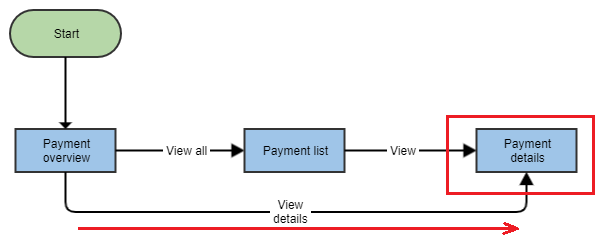

# 3. Navigation between Banklets

## Goal

* Understand routing between different application views (Banklets never route!)
* Understand asynchronously loaded feature modules in the application architecture

## Tasks

In this step we link the "Payment overview" dashboard with the "Payment details" view:



### 3.1 Add routing
Use the Angular CLI to generate the routing module that will take care of connecting the views of our application: 

```bash
npx ng generate module app-routing --flat --module app
```

* **--flat** puts the file in src/app instead of its own folder.
* **--module app** tells the CLI to register it in the imports array of the AppModule.

Now we need to add the DashboardComponent to the newly generated routing module. Modify the `src\app\app-routing.module.ts` file as follows:

```javascript
import { Routes, RouterModule } from '@angular/router';
import { NgModule } from '@angular/core';

import { DashboardComponent } from './dashboard/dashboard.component';

const routes: Routes = [
  {
    path: 'dashboard',
    component: DashboardComponent
  },
  {
    path: '',
    redirectTo: 'dashboard',
    pathMatch: 'full'
  },
];

@NgModule({
  imports: [RouterModule.forRoot(routes)],
  exports: [RouterModule],
})
export class AppRoutingModule {}
```

This tells the application to show the Dashboard when the URL points to `/dashboard`, and to redirect to the Dashboard in case no URL segment is specified.

### 3.2 Add the router outlet

Add the router outlet to the main page in `src\app\app.component.html`

```html
<main class="mat-app-background avq-padding-4">
    <router-outlet></router-outlet>
</main>
```
This acts as a placeholder, Angular fills this based on the current router state.

If you check the application, apparently nothing has changed as there is only one route. But now we can add more routes to the application.

### 3.3 Create a lazy-loadable module

In the command line, use the Angular CLI to generate the module:

```bash
npx ng generate module payments --route payments --module app
```

This automatically creates a `payments` folder with the new module `PaymentsModule` defined in the `payments.module.ts` file. 

At this point, we only care about the module itself: Angular CLI creates a default component and a route module that we do not need for the purpose of this exercise.

**Remove these** unneeded and automatically generated files:
* `payments-routing.module.ts`
* the four files (html, ts, scss and spec.ts) from `payments.component` 

All we have left is the `payments.module.ts` file.

Check the new routing entry in the main routing definition file `app-routing.module.ts`:

```javascript
  {
    path: 'payments', 
    loadChildren: () => import('./payments/payments.module').then(m => m.PaymentsModule)
  },
```

Notice how instead of routing to a specific local component like we did for the Dashboard, we are loading the whole payments module asynchronously via the `loadChildren` attribute: this means the module will be only loaded when the `/payments` URL is accessed.
 
For large apps with lots of routes, consider grouping related Banklets to a specific functionality (e.g. payment, wealth overview, trading, etc.) and lazy loading these modules separately. This pattern will help to keep initial bundle sizes smaller, which in turn helps decrease the initial load time. 

### 3.4 Create the Payment details component wrapper

Again use the Angular CLI to generate this component:

```bash
npx ng generate component payments/payment-detail --module payments --skipTests true
```

Modify the template to wrap the Payment Details Banklet in `src\app\payments\payment-detail\payment-detail.component.html`:

```html
<avq-web-banking-payment-details-banklet 
    [paymentIdRepresentation]="paymentIdRepresentation">
</avq-web-banking-payment-details-banklet>
```

The `avq-web-banking-payment-details-banklet` component has one *Input* parameter, which defines the payment shown in the details via a `paymentIdRepresentation`.

Entirely replace the component logic in `src\app\payments\payment-detail\payment-detail.component.ts` with:

```javascript
import {Component} from '@angular/core';
import {Router} from '@angular/router';

import {PaymentIdRepresentation} from '@avaloq/web-banking-common';

@Component({
  selector: 'app-page-three',
  templateUrl: './payment-detail.component.html'
})
export class PaymentDetailComponent {
  paymentIdRepresentation: PaymentIdRepresentation;

  constructor(router: Router) {
    // get payment id object from history state
    const state = router.getCurrentNavigation().extras.state || {};

    this.paymentIdRepresentation = state.paymentIdRepresentation;
  }

}
```

Take a look to that code, we are getting the `paymentIdRepresentation` from the route and passing it to the Banklet.

Add this component to the routes inside the module in `src\app\payments\payments.module.ts`, we will also need the `AvqI18nModule` module for the translations (more on this later):

```javascript
@NgModule({
  declarations: [PaymentDetailComponent],
  imports: [
    AvqI18nModule,
    CommonModule,
    RouterModule.forChild([
      {path: 'detail', component: PaymentDetailComponent},
    ]),
    PaymentDetailsBankletModule,
  ]
})
export class PaymentsModule {}
```

Remember to clean up the imports:
* Remove the unused `PaymentsRoutingModule` and `PaymentsComponent` imports
* Add the imports for the `AvqI18nModule`, the `RouterModule` and the `PaymentDetailsBankletModule` Banklet dependencies in the same file:

```javascript
import {RouterModule} from '@angular/router';

import {AvqI18nModule} from '@avaloq/i18n';

import {PaymentDetailsBankletModule} from '@avaloq/web-banking-payment-details-banklet';
```


### 3.5 Pass payment detail ID in routing

We need to link the dashboard with the Detail view. 

Once the Dashboard Banklet emits the `showPayment` event, we need to pass also the payment id. In this case we decided to pass it as part of the history navigation state. 

Modify the `onShowPayment` method inside the dashboard component `src\app\dashboard\dashboard.component.ts` file and add the routing to the `constructor`:

```javascript
  constructor(private router: Router) {}

  onShowPayment(payment: PaymentInList) {
    this.router.navigate(['payments/detail'], {
      state: {
        paymentIdRepresentation: payment.id
      }
    });
  }
```

### 3.6 Check browser navigation

Check the dashboard correctly navigates to the payment details by clicking on the Dashboard arrows. 

Pure browser navigation (back/forward) with payment details does not fully work because an open issue in the Angular router (it does not include extras.state on back navigation). 

Go to the `src\app\app.component.ts` file and **uncomment** the constructor code.

Note: You may need to restart the `npx ng serve` command, so Webpack can pick up the new module.


## Definition of done
* Navigation between dashboard and Payment details works
* Browser history navigation works between these two Banklets

Before moving to the next step, commit your changes locally (so you can check your incremental changes), or switch to the `step3` branch of this repository.

## Prev/Next steps
* [Step 2. Integrate a Banklet](./step2.md)
* [Step 4. Configuration of Banklets](./step4.md)
